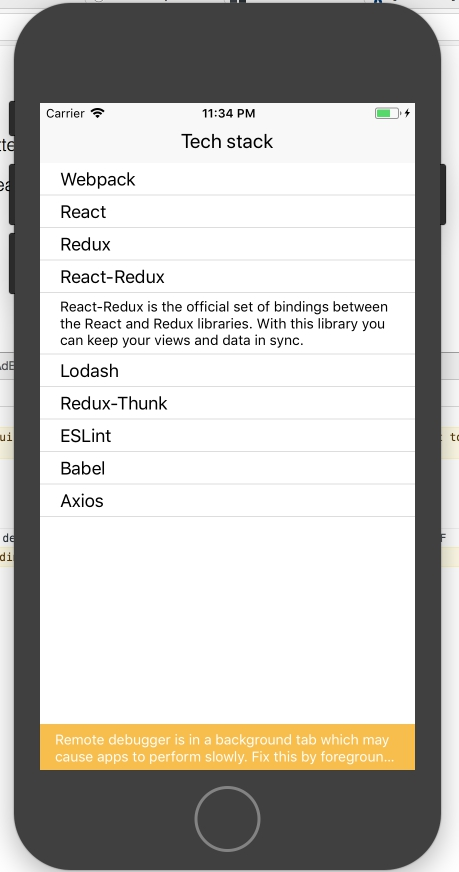

# Tech stack

Exercise project from excellent "[The Complete React Native and Redux Course](https://www.udemy.com/the-complete-react-native-and-redux-course/learn/v4/overview)" course by Stephen Grider.

Redux, Animations and proper list rendering with ListView.



## Installation

1. Install XCode (with iOS emulator).
2. Install React Native.
3. Run this project with

```
react-native run_ios
```
